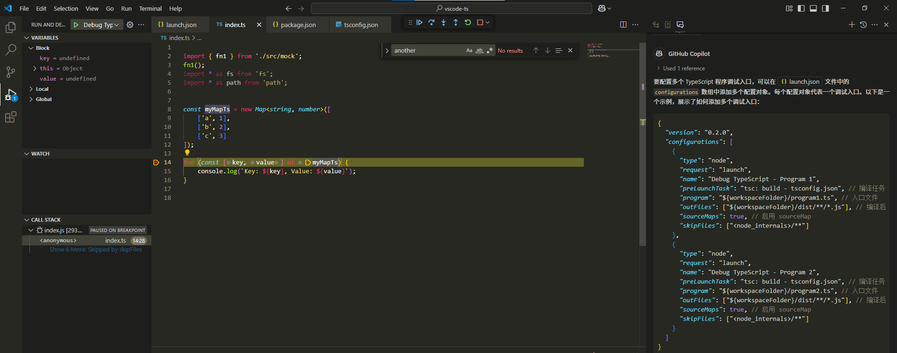

# typescript-practice

typescript调试，vscode环境配置

调试TypeScript的前提条件是要利用tsc将ts文件编译成原生的JavaScript文件

这个兼容性的问题有很多,且听我慢慢道来

实例项目结构如下:

```json
E:\code\vscode-ts>tree /f
Folder PATH listing for volume 新加卷
Volume serial number is 1E87-7BD0
E:.
│   index.ts
│   package-lock.json
│   package.json
│   tsconfig.json
│
├───.vscode
│       launch.json
│
├───dist
│   │   index.js
│   │   index.js.map
│   │   mock.js
│   │   mock.js.map
│   │
│   └───src
│           mock.js
│           mock.js.map
│
└───src
        mock.ts
```

## 安装ts环境依赖

全局安装typescript

```shell
npm install -g typescript
```

局部安装@types/node,安装 `@types/node` 后，你可以在 TypeScript 文件中使用 Node.js 的内置模块，并获得类型检查和代码补全功能,包含的内容

* **内置模块** ：如 `fs`、`path`、`http`、`crypto` 等。
* **全局变量** ：如 `process`、`Buffer`、`__dirname`、`__filename` 等。
* **全局接口** ：如 `EventEmitter`、`Stream` 等。
* **全局类型** ：如 `NodeJS.Timer`、`NodeJS.Process` 等。

```shell
npm i --save-dev @types/node
```

## 创建属于ts的tsconfig.json

与调试vue的项目配置文件vue.config.js类似,单纯调试ts项目需要创建tsconfig.json文件

- "target": "es6",
- "module": "commonjs", 意味着更好的兼容性.  当你在 tsconfig.json 中设置 `"module": "commonjs"` 时，TypeScript 编译器会将 ES 模块语法（`import` 和 `export`）编译为 CommonJS 模块语法（require 和 `module.exports`）。这意味着你可以在 TypeScript 代码中使用 ES 模块语法，编译后仍然可以在 Node.js 环境中使用 CommonJS 模块系统。
- "sourceMap": true,开启typescript的编译map映射
- "outDir": "./dist", ：指定输出目录,类似于Java中的target目录,不存在则新建
- "include": ["**/*.ts"], // 根据你的目录调整, 指定输入的ts文件目录, 一般这个目录尽可能放的宽泛如:`["**/*.ts"]`
- "exclude": ["node_modules"], 排除的编译目录

```json
{
  "compilerOptions": {
    "target": "es6",
    "module": "commonjs",
    "sourceMap": true,
    "outDir": "./dist", // ：指定输出目录
    "esModuleInterop": true,
    "skipLibCheck": true,
    "forceConsistentCasingInFileNames": true
  },
  "include": ["**/*.ts"], // 根据你的目录调整
  "exclude": ["node_modules"]
}
```

## 创建属于vscode的launch.js

- "type": "node"意味着ts基于node
- "request": "launch",
- "preLaunchTask": "tsc: build - tsconfig.json",编译命令,意味着每次启动调试之前都会先进行ts编译
- "program": "${workspaceFolder}/index.ts", 注意ts工程和Java工程类似,都必须指定项目入口
- "outFiles": ["${workspaceFolder}/dist/**/*.js"], // 编译后的 JS 路径,注意要与tsconfig.json中的输出路径一致
- "sourceMaps": true, // 启用 sourceMap

```json
{
  "version": "0.2.0",
  "configurations": [
    {
      "type": "node",
      "request": "launch",
      "name": "Debug TypeScript",
      "preLaunchTask": "tsc: build - tsconfig.json", // 编译任务
      "program": "${workspaceFolder}/index.ts", // 入口文件
      "outFiles": ["${workspaceFolder}/dist/**/*.js"], // 编译后的 JS 路径
      "sourceMaps": true, // 启用 sourceMap
      "skipFiles": ["<node_internals>/**"]
    }
  ]
}
```

要配置多个 TypeScript 程序调试入口，可以在 launch.json 文件中的 `configurations` 数组中添加多个配置对象。每个配置对象代表一个调试入口。以下是一个示例，展示了如何添加多个调试入口：但一般不这么做

```json
{
  "version": "0.2.0",
  "configurations": [
    {
      "type": "node",
      "request": "launch",
      "name": "Debug TypeScript1",
      "preLaunchTask": "tsc: build - tsconfig.json", // 编译任务
      "program": "${workspaceFolder}/index1.ts", // 入口文件
      "outFiles": ["${workspaceFolder}/dist/**/*.js"], // 编译后的 JS 路径
      "sourceMaps": true, // 启用 sourceMap
      "skipFiles": ["<node_internals>/**"]
    },
    {
      "type": "node",
      "request": "launch",
      "name": "Debug TypeScript2",
      "preLaunchTask": "tsc: build - tsconfig.json", // 编译任务
      "program": "${workspaceFolder}/index2.ts", // 入口文件
      "outFiles": ["${workspaceFolder}/dist/**/*.js"], // 编译后的 JS 路径
      "sourceMaps": true, // 启用 sourceMap
      "skipFiles": ["<node_internals>/**"]
    }
  ]
}

```

## 进行调试

打上断点, 按下F5


